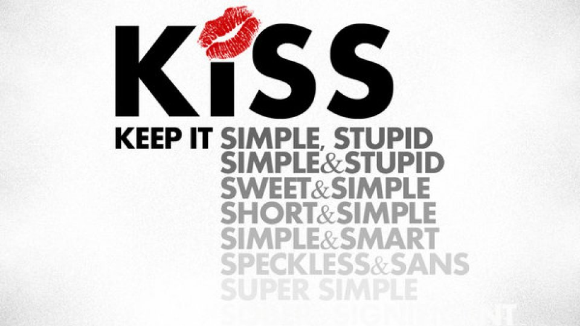

# Lab 3 - The action

## Why
Your start-up website needs more action. You need to improve the user experience and ensure the visitors enjoy interacting with you through your website.

You need to add JavaScript functionality to your website for more fun!

## In class
Define the JavaScript functions you need to add to make your website more appealing.

Implement an animation for your website using JavaScript.

Add a geolocation function using JavaScript.

## Homework
Complete your Website, including HTML, CSS, and JavaScript functionality. Be sure your work is easy to use and easy to maintain.

Upload your sources on Git. Be ready to present your results.

## Examples
There are tons of examples of high-quality, simple web pages from promising start-ups. Use them as examples to enrich your website.

Some Brasov area start-ups are here:

[https://www.neomorph.io/](https://www.neomorph.io/)

[https://www.easyic.com/](https://www.easyic.com/)

[https://countthings.com](https://countthings.com)

[https://www.mondly.com](https://www.mondly.com)

[https://lampix.com/](https://lampix.com/)

Please use KISS principles. Too much information does not help!

## KISS principle
