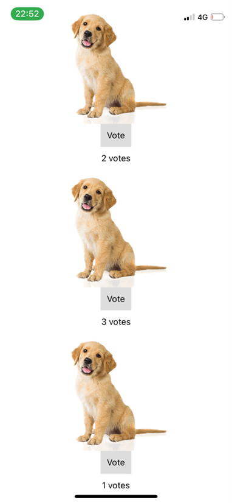

# Lab 8 - Vote app
## Build a voter
1. Import the basic components we will use in this lab

        import React, { Component } from 'react'
        import {
            StyleSheet,
            TouchableOpacity,
            Text,
            View,
            ScrollView
       } from 'react-native'

2. Create a VoteButton component that contains a clickable button.

        class VoteButton extends Component {
            render() {
                return (
                    <View>
                    <TouchableOpacity
                        style={styles.button}
                        onPress={this.onPress}
                    >
                        <Text>Vote</Text>
                    </TouchableOpacity>
                    </View>
                )
           }
        }
3. Add some styling

        const styles = StyleSheet.create({
            button: {
                alignItems: 'center',
                backgroundColor: '#DDDDDD',
                padding: 10,
                marginBottom: 10
            }
        })

4. Make this class the default

        export default VoteButton;

5. Scan the QR code and check it on your phone!

6. Add a text under the button that should count the votes.

        class VoteButton extends Component {
            render() {
                return (
                    <View>
                    <TouchableOpacity
                        style={styles.button}
                    >
                        <Text>Vote</Text>
                    </TouchableOpacity>
                    <View>
                        <Text>
                        0 votes
                        </Text>
                    </View>
                    </View>
                )
            }
        }

7. Add a state variable to your VoteButton class named count with the value 0.

        state = {count : 0}

8. Now change the text to display the value of count instead of 0.

        <Text>
        { this.state.count } votes
        </Text>
9. Now create a function named clicked inside the button class  that increases the value of count by 1.

        clicked = () => {
            this.setState({
                count: this.state.count + 1
            })
        }
10. Now link this function to your button by setting it as the onPress event handler

        <TouchableOpacity
                style={styles.button}
                onPress={this.clicked}
        >
                <Text>Vote</Text>
        </TouchableOpacity>

11. Check your phone again, this time around you should see the number of votes increasing as you click the button.

12. Congratulations! You finished the easy-peasy, copy-pasty part. Now on to real work …

13. Create another class component named VoteOption that contains an image and your VoteButton underneath.Make that one the default.

14. Create another class named My App that has 4 VoteOption components in a ScrollableView. Make that one the default.

